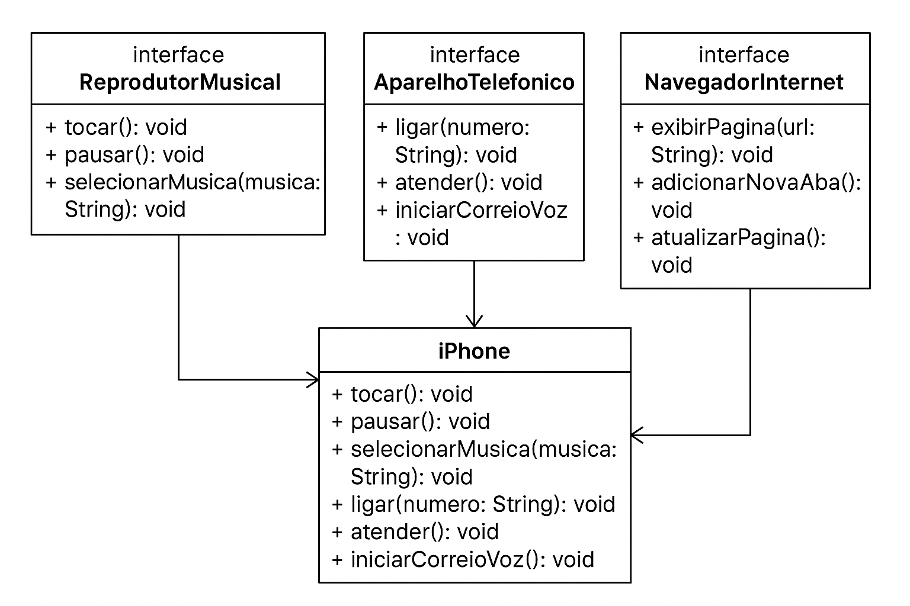

# 📱 POO - Desafio: Modelagem e Diagramação de um Componente iPhone

## 🎯 Descrição
Este desafio tem como objetivo **modelar** e **diagramar** a representação UML do componente **iPhone**, contemplando suas funcionalidades como:
- **Reprodutor Musical**
- **Aparelho Telefônico**
- **Navegador na Internet**

Além da modelagem, foi realizada a implementação das classes e interfaces em Java.

---

## 📽 Contexto
Com base no **vídeo de lançamento do iPhone em 2007**, foi criado o diagrama UML e, em seguida, implementado o código-fonte em Java.

🔗 **Vídeo de referência:** [Lançamento iPhone 2007](https://www.youtube.com/watch?v=VQKMoT-6XSg)  
📌 **Minutos relevantes:** `00:15` até `00:55`

---

## 🛠 Funcionalidades Modeladas

### 🎵 Reprodutor Musical
- `tocar()`
- `pausar()`
- `selecionarMusica(String musica)`

### 📞 Aparelho Telefônico
- `ligar(String numero)`
- `atender()`
- `iniciarCorreioVoz()`

### 🌐 Navegador na Internet
- `exibirPagina(String url)`
- `adicionarNovaAba()`
- `atualizarPagina()`

---

## 📊 Diagrama UML
O diagrama abaixo representa as interfaces e a classe `iPhone`, que implementa todas as funcionalidades:

---

## 📂 Estrutura do Projeto
📁 iPhoneUML
├── 📄 README.md
├── 📄 ReprodutorMusical.java
├── 📄 AparelhoTelefonico.java
├── 📄 NavegadorInternet.java
├── 📄 iPhone.java
├── 📄 Main.java
└── 📄 iPhone_UML_Diagram.png

